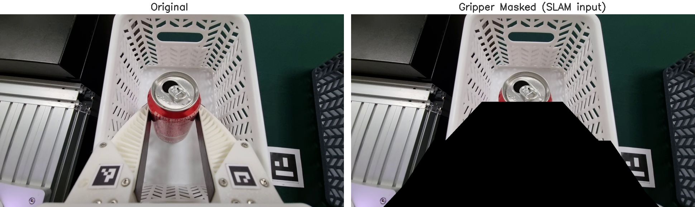

# Galaxy S21 기반 UMI 프로젝트

> **원본 논문 UMI (Universal Manipulation Interface)** 와의 핵심 차이:
> - 논문: GoPro 광각 카메라 + ORB-SLAM3 + IMU 융합
> - 본 프로젝트: Galaxy **S21** (0.5배율 카메라, 좁은 시야각) + **DROID-SLAM** only, IMU 미사용

---

## 목차

- [설치](#설치) — [INSTALL_UNIFIED.md](INSTALL_UNIFIED.md) 참조
1. [프로젝트 개요](#1-프로젝트-개요)
2. [파이프라인 전체 흐름](#2-파이프라인-전체-흐름)
3. [작업 — 다중 오브젝트 분류 배치](#3-작업--다중-오브젝트-분류-배치)
4. [핵심 트러블슈팅 요약](#4-핵심-트러블슈팅-요약) — T1~T4

---

## 설치

> **➜ [INSTALL_UNIFIED.md](INSTALL_UNIFIED.md)** — CUDA Toolkit, Miniforge, `umi_full` conda 환경 구성, 실행 테스트, 트러블슈팅 전 과정 포함

---

## 1. 프로젝트 개요

UMI는 스마트폰을 그리퍼에 장착해 사람이 직접 시연한 데이터를 수집하고, Diffusion Policy로 학습해 실제 로봇(Franka)이 모방하도록 하는 프레임워크다.

본 프로젝트는 **Galaxy S21** 을 활용해 UMI 파이프라인을 구성한 실험 기록이다.

### 논문 vs. 본 프로젝트 비교

| 항목 | 원본 UMI (논문) | 본 프로젝트 (S21) |
|------|-----------------|------------------|
| 카메라 | GoPro (광각, 넓은 FOV) | Galaxy S21 0.5배율 (좁은 FOV) |
| SLAM | ORB-SLAM3 + IMU 융합 | DROID-SLAM only |
| IMU | 사용 (VIO) | 미사용 |
| 환경 특징점 | 풍부 (광각으로 넓은 장면) | 제한적 (테이블 너머 배경 포함 주의) |
| 추가 조치 | — | ArUco 마커 + 테이블보 스티커로 특징점 보강 |

---

## 2. 파이프라인 전체 흐름

```
[Galaxy S21 앱으로 데모 데이터 수집]
        ↓  USB → receive_server.py 로 PC에 저장
[세션 폴더 준비]  ← 에피소드 데이터 + gripper_calibration 폴더 필요
        ↓
[Step 1]  run_slam_pipeline_s21.py process-droid
        ↓  DROID-SLAM 실행 → dataset_plan.pkl 생성
[Step 2]  droid_slam_s21/07_generate_replay_buffer.py
        ↓  dataset_plan.pkl → .zarr.zip 변환 (여러 환경 병합 가능)
[서버로 .zarr.zip 복사 후 .zarr로 변환]
        ↓
[Step 3]  train.py  ← Diffusion Policy 학습
        ↓  → .ckpt 파일 생성
[Step 4]  scripts_real/eval_real_umi_ensemble.py
        ↓  Franka 실제 로봇 평가
```

### Step 0 — 데이터 수신

S21 앱으로 촬영한 데이터를 USB로 PC에 수신한다.

```bash
# 터미널 1: USB 포트 포워딩
adb reverse tcp:8080 tcp:8080

# 터미널 2: 수신 서버 실행 (이 리포 루트에서 실행)
python receive_server.py
```

저장 위치: `~/Downloads/robotdatalearning_local/{session_id}/`

### (선택) 데모 영상 선별

수집한 데모 영상을 재생하며 품질을 확인하고 불량 에피소드를 골라낼 수 있다.

```bash
python review_demos.py /path/to/session_dir
```

| 키 | 동작 |
|----|------|
| `n` | 다음 영상 |
| `p` | 이전 영상 |
| `space` | 일시정지 / 재생 |
| `+` / `=` | 배속 증가 (0.25x 단위, 최대 8x) |
| `-` | 배속 감소 |
| `q` | 종료 |

특정 번호부터 시작하려면 인덱스를 두 번째 인자로 전달한다:
```bash
python review_demos.py /path/to/session_dir 10
```

---

### (선택) 영상 타임스탬프 수정

Android 앱이 AAC 오디오 타임스탬프를 부팅 시각 기준 절대값으로 기록하는 경우, 영상이 정상 재생되지 않을 수 있다. 이 경우 아래 스크립트로 일괄 수정한다.

```bash
python fix_audio_timestamps.py --input /path/to/session_dir
```

수정된 영상은 `<input_dir>/fixed/` 하위에 저장된다. 원본은 변경되지 않는다.

---

### Step 1 — DROID-SLAM 실행

명령어 하나로 세션 폴더 안의 **모든 에피소드에 대해 DROID-SLAM을 일괄 실행**한다. 에피소드마다 개별로 실행할 필요가 없다.

```bash
# 이 리포 루트에서 실행
python run_slam_pipeline_s21.py process-droid \
  --calibration_dir example/calibration_s21 \
  --ref aruco \
  /path/to/session_dir
```

`/path/to/session_dir` 아래의 모든 `session_*` 폴더를 자동 탐색해 순차적으로 SLAM을 수행하고, 마지막에 `dataset_plan.pkl`을 생성한다.

#### gripper_calibration 폴더

세션 폴더 안에 **`gripper_calibration`이라는 이름의 폴더가 반드시 1개** 있어야 한다. 이 폴더는 그리퍼의 열림/닫힘 범위를 보정하는 데 사용된다.

- 데이터 수집 시 **그리퍼 캘리브레이션 영상을 1회 별도로 촬영**해야 한다. 촬영 후에는 해당 폴더 이름(`session_20260605_103035` 형식)을 `gripper_calibration`으로 변경하면 된다.
- **정확히 1개만 있으면 된다.** 나머지 `session_*` 폴더(실제 데모 데이터)에 대해서는 별도로 캘리브레이션 영상을 찍을 필요 없이 SLAM과 데이터 변환만 자동으로 수행된다.

실행 전 폴더 구조 (앱으로 수집한 원본):
```
/path/to/session_dir/
├── gripper_calibration/            ← 에피소드 폴더 중 하나를 이름 변경 (1개만 필요)
│   ├── camera_ultrawide.mp4
│   ├── frame_timestamps.csv
│   ├── metadata.json
│   └── sensor_data.jsonl
├── session_20260610_160512/        ← 앱으로 촬영한 데모 1개 (촬영 시각이 폴더명)
│   ├── camera_ultrawide.mp4
│   ├── frame_timestamps.csv
│   ├── metadata.json
│   ├── sensor_data.jsonl
│   └── sync_frames.jsonl
├── session_20260610_161926/        ← 데모 1개 (총 데모 수만큼 폴더 존재)
└── ...
```

실행 후 생성되는 파일:
```
/path/to/session_dir/
├── demos/                                          ← 파이프라인이 자동 생성
│   ├── gripper_calibration_Galaxy_S21_.../         ← 그리퍼 캘리브레이션 처리 결과
│   │   ├── raw_video.mp4
│   │   ├── tag_detection.pkl
│   │   └── gripper_range.json
│   ├── demo_Galaxy_S21_1970.01.16_11.03.33.../    ← 각 에피소드 처리 결과
│   │   ├── raw_video.mp4
│   │   ├── camera_trajectory.csv   ← SLAM 포즈 결과
│   │   ├── tag_detection.pkl       ← ArUco 검출 결과
│   │   ├── tx_slam_tag.json        ← SLAM↔태그 좌표 변환
│   │   ├── frame_timestamps.csv
│   │   ├── sensor_data.jsonl
│   │   ├── metadata.json
│   │   ├── droid_stdout.txt        ← DROID-SLAM 로그
│   │   └── droid_stderr.txt
│   ├── demo_Galaxy_S21_.../
│   └── ...
└── dataset_plan.pkl                ← Step 2 입력 파일
```

> `--calibration_dir`에는 반드시 `example/calibration_s21/` 를 지정한다.
> S21 0.5배율 카메라의 intrinsics(`s21_intrinsics_1080p.json`)와 ArUco 설정(`aruco_config.yaml`)이 들어 있다.

#### 내부적으로 실행되는 스크립트

`run_slam_pipeline_s21.py process-droid` 명령어 하나가 아래 4개 스크립트를 순서대로 호출한다. 모두 `droid_slam_s21/` 폴더에 위치한다.

| 파일 | 역할 |
|------|------|
| `droid_slam_s21/00_process_videos.py` | 세션 폴더의 영상 파일을 `demos/` 구조로 정리 |
| `droid_slam_s21/03_batch_slam.py` | 각 데모 영상에서 프레임 추출 → DROID-SLAM 실행 → `camera_trajectory.csv` 생성. `umi_full` conda 환경을 자동 호출 |
| `droid_slam_s21/04_detect_aruco.py` | 영상에서 ArUco 마커를 검출해 `tag_detection.pkl` 생성. 좌표 기준점 설정에 사용 |
| `droid_slam_s21/05_run_calibrations_per_episode.py` | SLAM 궤적과 ArUco 태그 좌표를 결합해 그리퍼 캘리브레이션 및 `tx_slam_tag.json` 생성. 에피소드별로 독립적으로 수행 |
| `droid_slam_s21/06_generate_dataset_plan.py` | 전체 처리 결과를 종합해 `dataset_plan.pkl` 생성. 다음 단계(Step 2)의 입력 파일 |

> **파일 번호가 00 → 03으로 건너뛰는 이유**: 원본 UMI(ORB-SLAM3)에는 IMU 변환(`01`)과 맵 생성(`02`) 단계가 있었으나 DROID-SLAM 버전에서는 불필요해 제거됐다.

하나의 스크립트라도 실패하면 파이프라인이 중단된다. 각 데모 폴더의 `droid_stderr.txt`에서 오류 내용을 확인할 수 있다.

#### 그리퍼 마스킹

`03_batch_slam.py`는 프레임 추출 시 그리퍼 영역(손가락 + 손가락 사이 공간 포함)을 검은색으로 덮어씌운 뒤 DROID-SLAM에 입력한다.

**이유**: DROID-SLAM은 프레임 간 광학 흐름(optical flow)을 추적해 카메라 포즈를 추정한다. 그리퍼가 카메라 하단에 고정 장착되어 항상 시야에 잡히는데, 그리퍼가 열리고 닫힐 때 손가락 및 손가락 사이 배경 영역도 함께 움직인다. SLAM이 이 움직임을 카메라 자체의 이동으로 잘못 해석하면 포즈 추정이 오염된다. 그리퍼 전체 영역을 마스킹해 이 문제를 방지한다.



왼쪽이 원본 프레임, 오른쪽이 SLAM에 실제로 입력되는 마스킹된 프레임이다. 그리퍼 손가락과 그 사이 공간이 검은색으로 제거된 것을 확인할 수 있다.

> **"그리퍼 너비(열림/닫힘 정도)는 어떻게 알 수 있나?"**
> 그리퍼 너비는 SLAM이 아니라 **ArUco 마커**에서 별도로 측정한다. 그리퍼 양쪽 손가락에 부착된 마커(ID 0: 왼쪽, ID 1: 오른쪽)를 `04_detect_aruco.py`가 검출하고, `05_run_calibrations_per_episode.py`가 `gripper_calibration` 영상에서 두 마커 간 거리를 측정해 완전 열림/닫힘 범위를 `gripper_range.json`으로 저장한다. 이후 `06_generate_dataset_plan.py`가 각 데모 에피소드의 프레임별로 그리퍼 너비를 0~1로 정규화해 학습 데이터에 포함시킨다. 즉, **카메라 포즈(SLAM) 와 그리퍼 너비(ArUco)는 완전히 독립된 경로로 측정된다.**

---

### Step 2 — zarr 파일 생성

`dataset_plan.pkl`을 학습용 `.zarr.zip` 파일로 변환한다.

**단일 환경:**
```bash
python droid_slam_s21/07_generate_replay_buffer.py \
  -o /path/to/session_dir/dataset.zarr.zip \
  /path/to/session_dir
```

**여러 환경 병합** (다환경 학습 시):
```bash
python droid_slam_s21/07_generate_replay_buffer.py \
  /path/to/session_white \
  /path/to/session_green \
  /path/to/session_wine \
  /path/to/session_recovery \
  -o /path/to/output/dataset_combined.zarr.zip
```

---

### (선택) 결과 확인

zarr.zip 생성 후 영상 재생 및 그래프로 궤적을 확인할 수 있다.

**영상 재생** (프레임 단위 재생, `q`: 종료, `n`: 다음 에피소드):
```bash
python scripts_slam_s21/visualize_zarr.py /path/to/dataset.zarr.zip
```

**그래프 출력** (파일 2개 생성: 개요 + 6DOF 시계열):
```bash
python scripts_slam_s21/visualize_dataset_rpy.py \
  -i /path/to/dataset.zarr.zip \
  -o /path/to/trajectory.png
```

---

### Step 3 — 학습

로컬에서 만든 `.zarr.zip`을 학습 서버로 복사한 뒤 `.zarr`로 변환하고 학습을 실행한다.

```bash
# .zarr.zip → .zarr 이름 변경 (서버에서)
cp dataset_combined.zarr.zip data/dataset_combined.zarr

# 학습 실행
CUDA_VISIBLE_DEVICES=0 python train.py \
  --config-name=train_diffusion_unet_timm_umi_workspace \
  task.dataset_path=data/dataset_combined.zarr \
  training.resume=True
```

결과물: `data/outputs/날짜/시각_train_diffusion_unet_timm_umi/checkpoints/` 에 `.ckpt` 파일 생성

#### 주요 학습 파라미터

전체 설정: [`diffusion_policy/config/train_diffusion_unet_timm_umi_workspace.yaml`](diffusion_policy/config/train_diffusion_unet_timm_umi_workspace.yaml)

| 파라미터 | 값 | 설명 |
|----------|----|------|
| `num_epochs` | 90 | 총 학습 횟수 (epoch 10, 20, ..., 90에서 체크포인트 저장, epoch 90 = latest.ckpt) |
| `batch_size` | 32 | 한 번에 학습하는 데이터 수 |
| `lr` | 1e-4 | 학습률 (AdamW) |
| `lr_scheduler` | cosine | 학습률 스케줄러 |
| `lr_warmup_steps` | 2000 | 학습률을 서서히 올리는 초기 스텝 수 |
| `weight_decay` | 1e-6 | 과적합 방지 정규화 강도 |
| `gradient_accumulate_every` | 2 | 그래디언트 누적 횟수 |
| `checkpoint_every` | 10 | 10에폭마다 체크포인트 저장 |
| `num_train_timesteps` | 50 | Diffusion 노이즈 스케줄 스텝 수 |
| `num_inference_steps` | 16 | 추론 시 디노이징 스텝 수 |
| `input_pertub` | 0.03 | 입력 노이즈 강도 |
| `obs_encoder` | ViT-B/16 (CLIP) | 이미지 인코더 모델 |

---

### Step 4 — Franka 실제 로봇 평가

```bash
python scripts_real/eval_real_umi_ensemble.py \
  --robot_config=example/eval_franka_robots_config.yaml \
  --mask_mode s21 \
  -i ckpt/latest.ckpt \
  -o eval_data/
```

> `--mask_mode s21`: S21 그리퍼 하단 영역을 마스킹한다.

### (선택) 평가 결과 시각화

평가 중 저장된 `debug_log.pkl`과 영상을 불러와 모델이 각 스텝에서 예측한 action을 영상 옆에 그래프로 붙인 분석 비디오를 생성한다.

```bash
python visualize_eval_video.py \
    /path/to/eval_data \
    $(ls /path/to/eval_data/videos)
```

출력: `eval_data/all_analysis_results/test/` 하위에 에피소드별 mp4 파일 저장

특정 에피소드만 처리:
```bash
python visualize_eval_video.py /path/to/eval_data 208 211_fail_intermediate
```

---

## 3. 작업 — 다중 오브젝트 분류 배치

> 실험 세팅 및 결과는 추후 상세 작성 예정이다.

### 작업 1 — 공·큐브 바구니 분류

큐브 2개와 공 2개를 테이블 위 랜덤한 위치에서 집어 각각의 매칭 바구니에 넣는 작업이다.

- 큐브 2개 → 바구니 A
- 공 2개 → 바구니 B
- 오브젝트 위치, 바구니 위치 모두 랜덤

### 작업 2 — 캔·페트병 분리수거

실제 음료수 캔과 페트병을 종류별 분리수거 바구니에 넣는 작업이다.

---

## 4. 핵심 트러블슈팅 요약

### T1. 특정 방향 이동 시 SLAM 포즈 진동

| 항목 | 내용 |
|------|------|
| **증상** | 특정 방향으로 이동하는 프레임에서 x, y, z 값이 크게 진동 |
| **원인** | 카메라 시야에 테이블 너머 먼 배경 물체가 포함됨 |
| **해결** | ① DROID-SLAM 파라미터 튜닝 ② 배경 물체 제거 ③ 포즈가 튀는 에피소드 학습 데이터에서 필터링 제외 |
| **교훈** | S21의 좁은 FOV는 배경 오염에 민감 — 작업공간 주변 정리 필수 |

### T2. 단색 테이블보에서 SLAM 특징점 부족

| 항목 | 내용 |
|------|------|
| **증상** | 민무늬 테이블보에서 DROID-SLAM feature tracking 불안정 |
| **원인** | 균일한 색상 → 특징점(keypoint) 부족 |
| **해결** | 테이블보에 다양한 모양의 스티커 부착 (화살표, 네모, 별, 십자가) |

### T3. Recovery 데모 추가로 성공률 향상

| 항목 | 내용 |
|------|------|
| **증상** | 파지 실패 후 복구 동작 없이 에피소드 실패 |
| **해결** | 실패 상황에서의 복구 동작 데모 별도 수집 후 병합 학습 |
| **효과** | 성공률 유의미하게 향상 |

### T4. DROID-SLAM 파라미터 튜닝

DROID-SLAM의 궤적 품질은 세 파라미터(filter_thresh, keyframe_thresh, warmup)에 민감하게 반응했으며, 특정 구간의 문제를 해결하면 다른 구간에서 새로운 문제가 발생하는 트레이드오프가 존재했다.

#### 각 파라미터의 역할

| 파라미터 | 역할 |
|----------|------|
| `filter_thresh` | 광학 흐름(optical flow)의 신뢰도 필터. 높일수록 신뢰도 낮은 대응점을 강하게 제거 |
| `keyframe_thresh` | 새 키프레임을 삽입하는 기준 이동량. 낮출수록 키프레임을 더 자주 생성해 빠른 움직임 구간을 촘촘하게 추적 |
| `warmup` | 본격 추적 시작 전 초기 키프레임 그래프를 구성하는 데 사용하는 프레임 수. DROID-SLAM 내부의 Bundle Adjustment(BA)가 수렴하려면 초기 그래프에 충분한 제약 조건이 필요 |

#### 튜닝 과정

**1단계 — 90–150프레임 구간 불안정 해결**

초기 파라미터(filter_thresh=2.4, keyframe_thresh=4.0, warmup=8) 상태에서 로봇이 공을 집어 이동하는 90–150프레임 구간에서 20–30개 에피소드의 Z축이 크게 튀었다.

이 구간은 EE가 테이블 바깥 방향으로 회전하며 물체를 내려놓는 동작이 이루어지는 구간이다. 카메라 시야에서 작업공간인 테이블이 차지하는 비중과 테이블 너머의 배경 공간이 차지하는 비중이 비슷해지면서, DROID-SLAM이 어느 쪽을 기준으로 위치를 추정해야 할지 혼동하여 포즈 추정값이 불안정해진 것으로 분석된다.

해결을 위해 두 가지 조치를 병행했다.

- **환경 통제**: 테이블 너머에 놓인 사물들을 제거해 배경의 특징점 오염을 차단
- **파라미터 조정**:
  - `filter_thresh` 2.4 → 3.4: 저신뢰도 광학 흐름 대응점을 더 강하게 제거
  - `keyframe_thresh` 4.0 → 1.0: 빠른 움직임 구간을 키프레임으로 더 촘촘하게 커버

→ 90–150프레임 구간 불안정 해소. 그러나 `keyframe_thresh`를 1.0으로 낮추자 초반부터 키프레임이 과도하게 생성되어 **0–50프레임 구간에서 60개 에피소드가 새롭게 불안정**해지는 문제가 발생했다.

**2단계 — 전구간 균형 조정**

`filter_thresh`=2.4, `keyframe_thresh`=2.8로 재조정해 두 구간 사이의 균형을 맞췄으나, 초반 불안정은 완전히 해소되지 않았다. 문제의 근본 원인이 다른 곳에 있음을 확인했다.

**3단계 — warmup 파라미터로 근본 해결**

`warmup`=8이면 BA가 수렴하기에 제약 조건이 너무 부족한 상태로, 초기 자세 추정이 잘못된 해로 수렴하고 이 오류가 이후 전체 프레임에 누적·전파된다. `warmup`을 8 → 26으로 높여 초기 그래프가 충분한 키프레임을 확보한 뒤 추적을 시작하게 하자 **120개 에피소드 전 구간에서 불안정 에피소드가 0개**로 완전히 해소됐다.

#### 최종 파라미터

| 파라미터 | 초기값 | 최종값 |
|----------|--------|--------|
| `filter_thresh` | 2.4 | 2.4 |
| `keyframe_thresh` | 4.0 | 2.8 |
| `warmup` | 8 | 26 |

> **핵심 교훈**: 90–150프레임 구간의 불안정은 환경 통제(배경 정리)와 filter/keyframe 파라미터 조정으로 해결했으나, 초반 구간의 근본적인 불안정은 SLAM 초기화 메커니즘인 warmup 부족에서 비롯된 것이었다. warmup을 26으로 높이는 것이 결정적인 해결책이었다.

---

## 참고

- **원본 UMI 논문**: [https://umi-gripper.github.io/](https://umi-gripper.github.io/)
- **DROID-SLAM**: [https://github.com/princeton-vl/DROID-SLAM](https://github.com/princeton-vl/DROID-SLAM)
- **Franka 평가 설정**: [example/eval_franka_robots_config.yaml](example/eval_franka_robots_config.yaml)
